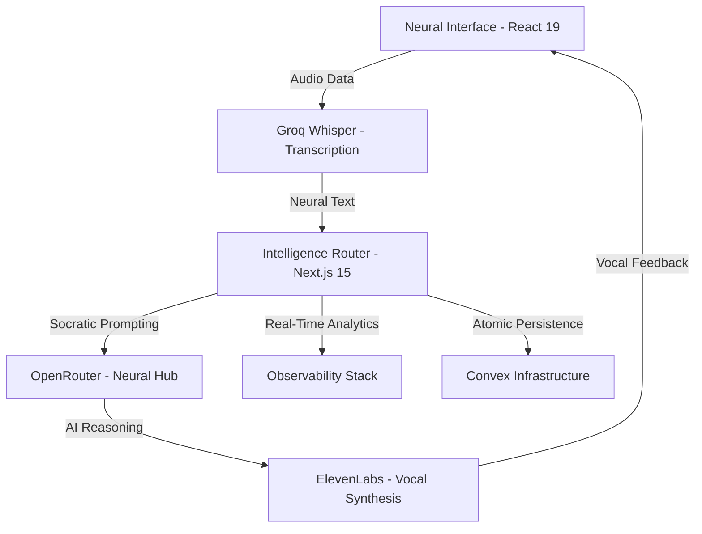

# 🎙️ Voce.AI
### *The Neural Interface for Spoken Intelligence*

---

> **A visionary concept conceived and engineered by Shrey Bansal.**
>
> Voce.AI is the absolute pinnacle of AI-driven conversational coaching. It is an immersive workspace built for those who demand an elite interface for high-stakes interview practice, linguistic mastery, and cognitive growth. This project represents the extreme limit of current full-stack AI orchestration.

---

## 🏛️ The Architecture of Excellence

Voce.AI is a high-availability, low-latency platform that synthesizes Socratic dialectics with neural audio processing.



---

## 🧪 The "Lavender Glass" Paradigm

Voce.AI features an "Untouchable" aesthetic known as **Lavender Glass**. This unique design system was designed to bridge the gap between high-tech professional tools and soft, human-centric interactions.

- **Neural Foundations**: Built on a deep midnight purple base (`oklch(0.12 0.03 285)`) to ground the interface with a professional, soft feel.
- **Glassmorphic Precision**: High-fidelity `.glass-panel` utilities featuring **32px backdrop-filters** and **15% rim-highlight rings** (`ring-white/10`).
- **Kinetic Intelligence**: 300ms cubic-bezier transition curves ensure the UI feels alive, responsive, and immediate.

---

## 🧠 Socratic Intelligence Engine

At its core, **Voce.AI** moves beyond basic chat. It employs a **Socratic Coaching Strategy** that probes the user's depth of knowledge through active, dialectical questioning.

- **Groq Integration**: Near-instant transcription (Whisper) for seamless natural conversation.
- **Neural Routing**: Dynamic LLM switching via OpenRouter to ensure the highest fidelity of logic.
- **Vocal Realism**: Best-in-class speech synthesis via ElevenLabs for an "Uncanny Valley" shattering human experience.

---

## 📊 Full-Stack Observability

Engineering excellence is measured by what you can see. Voce.AI includes a complete **Scope-A telemetry stack**:
- **Real-Time Metrics**: Prometheus instrumentation for AI latency, token usage, and hit rates.
- **Custom Visuals**: Pre-configured Grafana dashboards for monitoring the economic and technical pulse of the platform.
- **Reactive Storage**: Real-time mutations via Convex ensure data is never stale and always atomic.

---

## 🚀 Coronation (Quick Start)

```bash
# 1. Clone the Frontier
git clone https://github.com/shreybansal365/Voce.AI.git
cd Voce.AI

# 2. Satisfy the Neural Environment
# Configure your .env.local with Convex, OpenRouter, and ElevenLabs keys.

# 3. Launch the Masterpiece
docker compose up -d --build
```

---

## 📜 Professional Governance
Examine the [CONTRIBUTING.md](./CONTRIBUTING.md) and [LICENSE](./LICENSE) for the standards of engineering preserved in this repository.

---
© 2026 Voce.AI. **Perfecting the Sound of Intelligence.**
