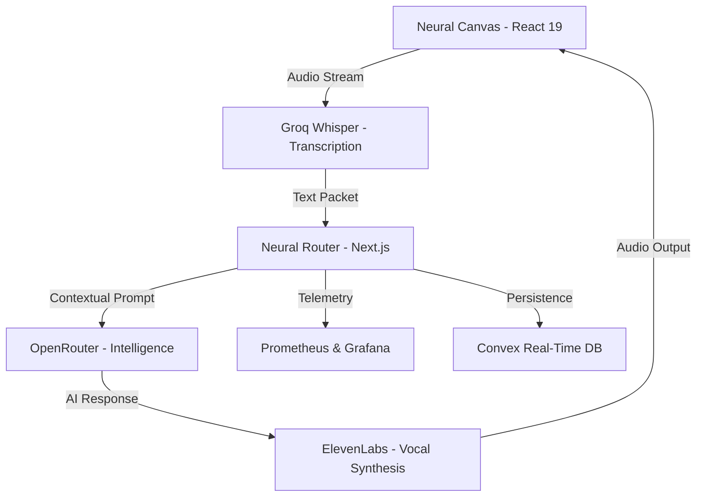

# 🎙️ Voce.AI
### *The Ultimate Frontier of Spoken Intelligence*

[](https://nextjs.org/)
[](https://react.dev/)
[](https://tailwindcss.com/)
[](https://www.convex.dev/)

**Voce.AI** (pronounced */voʊs/* — Latin for *Voice*) is an elite neural-audio platform designed for high-context conversational coaching. By synthesizing **Socratic Dialectics** with **32px Glassmorphic Design**, Voce.AI creates a transformative workspace for perfecting human speech, interview mastery, and linguistic immersion.

---

## 🏛️ System Architecture

Voce.AI operates on a high-availability serverless stack, orchestrating a complex flow of audio packets, neural transcriptions, and LLM-driven feedback loops.



---

## 💎 The Lavender Glass Paradigm

Voce.AI isn't just an interface; it's a **Design Philosophy**. We have transcended standard dark-mode UI to create the "Lavender Glass" system:

- **Perceptual Uniformity**: Utilizes the `oklch(0.12 0.03 285)` color space for deep, desaturated violet foundations.
- **Glassmorphism**: High-fidelity `.glass-panel` utilities with dynamic **32px filters** and **15% ring highlights** (`ring-white/10`).
- **Kinetic Feedback**: 300-400ms cubic-bezier transition curves that make the interface feel alive and responsive to human interaction.

---

## 🚀 Engineering Excellence

- **Latency-Optimized Inference**: Utilizes Groq's high-speed Whisper endpoints and OpenRouter's low-latency LLM switching.
- **Resilient AI Feedback**: A decoupled telemetry architecture ensures that AI assessments are delivered instantly, even during complex metric synchronization.
- **Full Observability**: Real-time monitoring of token consumption, request rates, and AI investment costs via an integrated **Grafana** dashboard.

---

## 🛠️ Deployment & Orchestration

### Prerequisites
- **Node.js 20+**
- **Docker & Compose** (for the Observability Stack)

### 1. Initialization
```bash
git clone https://github.com/shreybansal365/voce-ai-conversational-platform.git
cd voce-ai-platform
npm install
```

### 2. Neural Environment
Configure your `.env.local` to satisfy the AI route handlers:
```bash
NEXT_PUBLIC_CONVEX_URL= # Neural Persistence
OPENROUTER_API_KEY=     # Intelligence Engine
GROQ_API_KEY=           # Audio Processing
ELEVENLABS_API_KEY=     # Vocal Synthesis
```

### 3. Production Pulse
Launch the platform and the Scope-A monitoring stack:
```bash
docker compose up -d --build
```
- **Voce.AI Interface**: `http://localhost:3000`
- **Observability Hub**: `http://localhost:3002`

---

## 📜 Professional Governance

Voce.AI is maintained with an elitist commitment to code quality and design integrity. Review our [CONTRIBUTING.md](./CONTRIBUTING.md) and [LICENSE](./LICENSE) for standards.

---
© 2026 Voce.AI. **Elevate Your Spoken Intelligence.**
