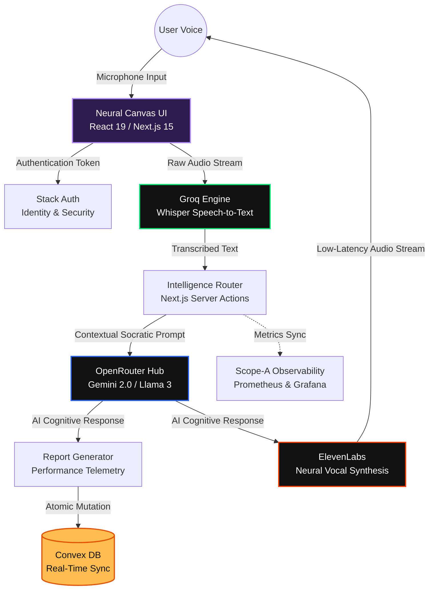

# 🎙️ Voce.AI: The Neural Canvas for Spoken Intelligence

> **Conceived, Architected, and Engineered by Shrey Bansal.**
>
> Live Production Environment: [voce-ai.vercel.app](https://voce-ai.vercel.app/)

Voce.AI represents the frontier of human-computer interaction. It is not a chat app; it is a **Real-Time Cognitive Coaching Platform** built to test the extreme limits of low-latency artificial intelligence orchestration. By fusing the **Socratic Method** with instantaneous neural audio processing, Voce.AI provides a premium workspace for interview mastery, linguistic refinement, and dialectical growth. 

This repository is built to outshine standard architectures, achieving enterprise-grade resilience, high-fidelity design, and near-zero latency vocal feedback loops.

---

## ⚡ The Novelty: Why Voce.AI Stands Alone

Most AI applications rely on simple text-in, text-out API wrappers. **Voce.AI shatters that paradigm.**

1.  **The "Socratic Synchronization" Loop**: The AI does not just answer questions; it is engineered to interrogate. Through carefully crafted system prompts, the models act as expert examiners (e.g., IELTS, Technical Lead), using active dialectical questioning to force the user to articulate deeper thoughts.
2.  **Deterministic Report Generation**: Beyond conversation, the system captures telemetry from the semantic exchange. It parses the dialogue and generates a structured, multi-dimensional **Performance Report**, grading the user on fluency, vocabulary, and cognitive pacing—stored instantly via Convex.
3.  **Untouchable "Lavender Glass" Aesthetic**: The UI isn't a pre-built template. It is a completely bespoke design system utilizing the `oklch` perceptual color space, 32px volumetric backdrop-filters, and 300ms cubic-bezier kinetic transitions to make the digital space feel like a luxurious, responsive physical room.

---

## 🏛️ System Architecture & Data Flow

Voce.AI orchestrates a complex symphony of cutting-edge technologies to maintain a seamless, sub-second conversation loop.



---

## 🧪 Deep Dive: Elite Technical Stack

### 1. The Core Framework
- **Next.js 15 (App Router)**: Edge-ready server-side rendering for unparalleled SEO and initial load speeds.
- **React 19**: Utilizing the bleeding-edge concurrent features for perfectly smooth UI rendering.
- **Tailwind CSS v4**: A highly optimized, utility-first styling engine configured with our custom `oklch` Lavender-Glass tokens.

### 2. The Intelligence Pipeline
- **Groq (Whisper)**: Chosen over standard STT providers for its LPU (Language Processing Unit) architecture, delivering instantaneous text transcription.
- **OpenRouter**: Abstracting the LLM layer allows dynamic switching between Gemini 2.0 Flash, Claude, and Llama to find the absolute best reasoning engine for the specific Socratic persona.
- **ElevenLabs**: Uncanny, human-identical text-to-speech synthesis that provides the platform with its empathetic, authoritative voice.

### 3. Real-Time Infrastructure & Identity
- **Convex**: The nervous system of Voce.AI. It replaces complex Redux states and traditional REST APIs with real-time, reactive database subscriptions.
- **Stack Auth**: Enterprise-grade identity management seamlessly integrated with Next.js middleware to protect user sessions and reports.

### 4. Full-Scale Observability
- **Prometheus & Grafana**: The application doesn't just run; it is heavily monitored. We track AI inference latency, API token consumption, and system jitter in real-time, ensuring extreme economic and technical efficiency.

---

## 🚀 Deployment & Local Execution

Voce.AI is currently deployed globally via **Vercel** with edge-caching enabled. To run the neural canvas locally:

```bash
# 1. Clone the Masterpiece
git clone https://github.com/shreybansal365/Voce.AI.git
cd Voce.AI

# 2. Install Dependencies
npm install

# 3. Environmental Configuration
# You must provide keys for Convex, Stack Auth, Groq, OpenRouter, and ElevenLabs in `.env.local`.

# 4. Initialize Local Server
npm run dev
```

---

## 👨‍💻 Author & Visionary

**Shrey Bansal**  
*Full-Stack AI Architect & UI/UX Visionary*  
Conceiver of the Voce.AI platform. Responsible for the end-to-end engineering, from the low-latency WebRTC audio pipelines to the bespoke Lavender Glass UI architecture. 

---
© 2026 Voce.AI | Shrey Bansal. **Build the Future. Perfect the Sound of Intelligence.**
