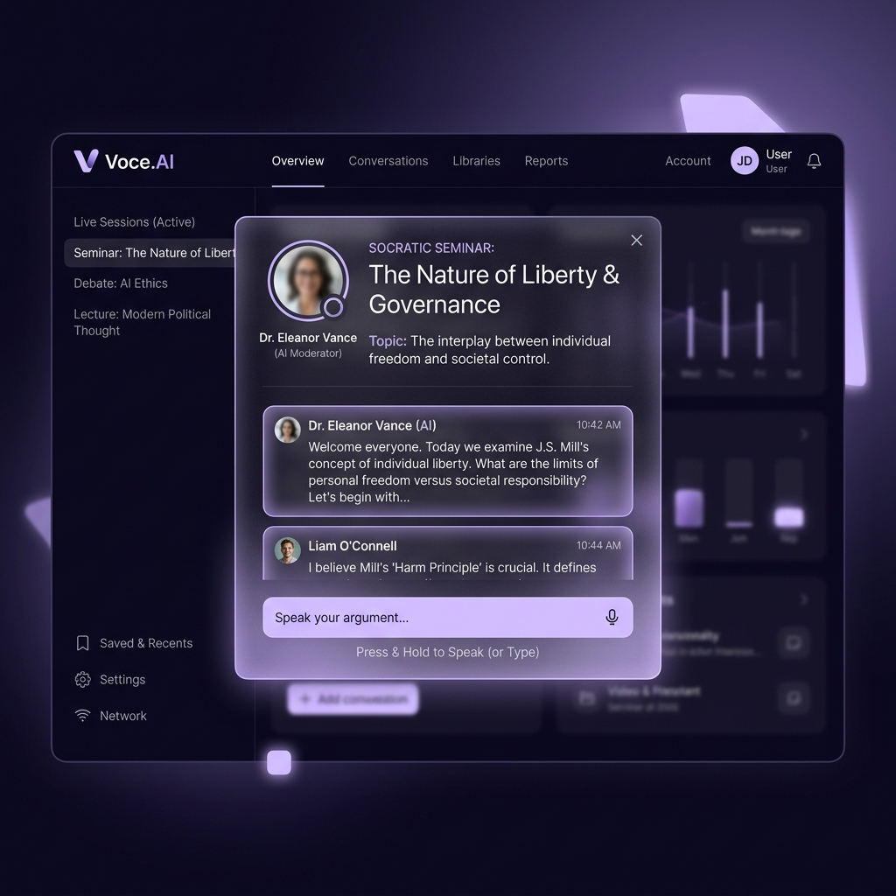
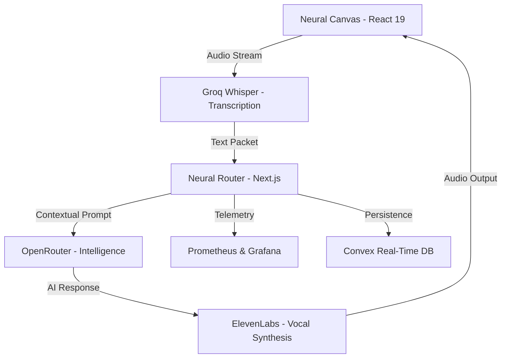

# 🎙️ Voce.AI
### *The Neural Canvas for Spoken Intelligence*



[](https://nextjs.org/)
[](https://tailwindcss.com/)
[](https://www.convex.dev/)
[](http://localhost:3002)

**Voce.AI** (pronounced */voʊs/*) is a premium conversational intelligence platform that transforms speech into growth. By synthesizing **Socratic Dialectics** with a high-fidelity **Lavender Glass** workspace, Voce.AI provides the ultimate immersive environment for perfecting human communication, interview mastery, and cognitive coaching.

---

## ✨ The Experience

### 🎭 Neural Persona Specialists
Engage with a curated suite of AI experts. From **IELTS Examiners** to **Technical leads**, each persona utilizes the Socratic method of active questioning to probe depth of knowledge and elevate your spoken articulation.

### 🧪 State-of-the-Art interaction
Built on the **Lavender Glass** design paradigm, the interface utilizes the `oklch` color space for perceptual uniformity. Enjoy a high-fidelity, 32px backdrop-blur environment that feels alive, responsive, and professional.

### 📊 Real-Time Cognitive Analytics
Every session is powered by an AI feedback engine that generates structured, multi-dimensional assessments. Track your fluency, vocabulary, and pacing through a resilient data pipeline optimized for low-latency delivery.

---

## 🏛️ Architectural Blueprint

Voce.AI orchestrates a complex symphony of audio packets and neural inference to ensure near-zero latency in voice feedback loops.



---

## 🛠️ Elite Technical Foundation

- **Framework**: [Next.js 15](https://nextjs.org/) (App Router) & [React 19](https://react.dev/)
- **Style Engine**: [Tailwind CSS v4](https://tailwindcss.com/) with custom **Lavender Glass** utilities.
- **Intelligence**: [OpenRouter](https://openrouter.ai/) for high-context LLM switching and [Groq](https://groq.com/) for instant transcription.
- **Backend Architecture**: [Convex](https://www.convex.dev/) for real-time synchronization and high-performance persistence.
- **Scope-A Observability**: Full [Prometheus](https://prometheus.io/) instrumentation and [Grafana](https://grafana.com/) visualization.

---

## 🚀 Coronation (Deployment)

### 1. Configure the Neural Environment
Satisfy the AI route handlers via `.env.local`:
```bash
NEXT_PUBLIC_CONVEX_URL= # Neural Persistence
OPENROUTER_API_KEY=     # Intelligence Engine
GROQ_API_KEY=           # Audio Processing
ELEVENLABS_API_KEY=     # Vocal Synthesis
```

### 2. Launch the Platform
Push the platform and its observability stack live:
```bash
docker compose up -d --build
```
- **Voce.AI Interface**: `http://localhost:3000`
- **Observability Hub**: `http://localhost:3002`

---

## 📜 Professional Governance

Voce.AI is maintained with an elitist commitment to engineering excellence. Review our [CONTRIBUTING.md](./CONTRIBUTING.md) and [PORTFOLIO_GUIDE.md](./PORTFOLIO_GUIDE.md) for career-framing insights.

---
© 2026 Voce.AI. **Perfecting the Sound of Intelligence.**
